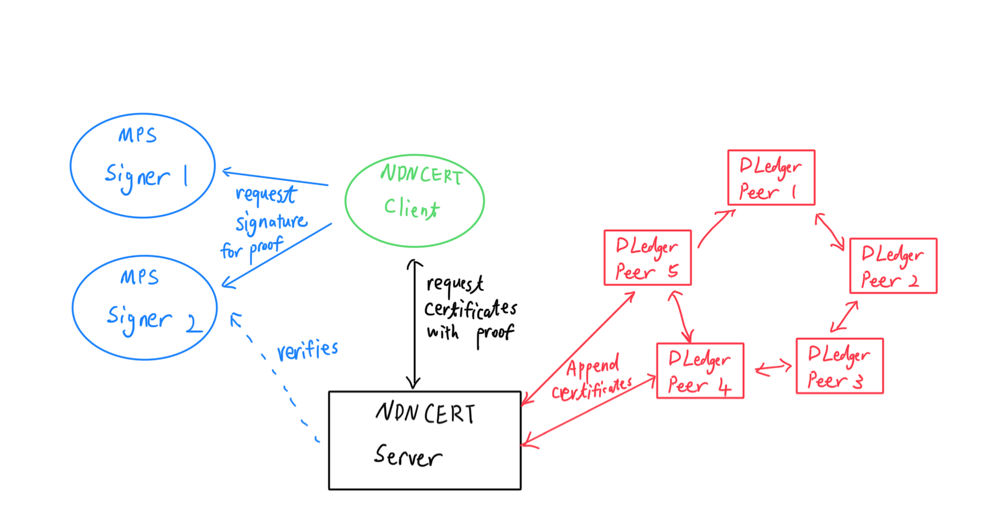
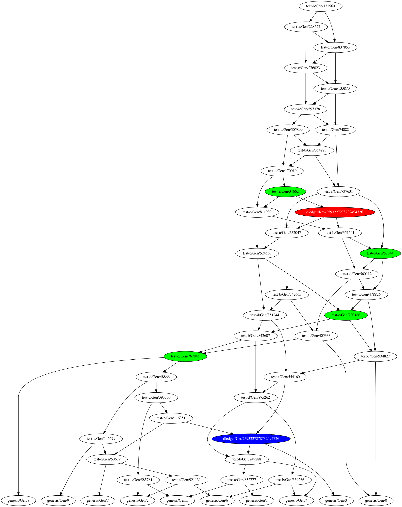

# Demo

This demo demonstrates the use of multisignature library with NDNCERT and Dledger. 

The code for demonstration is in [NDNCERT branch](https://github.com/Zhiyi-Zhang/ndncert/tree/v0.3-dledger/demo).

## Participants
This demo setup has 9 total peers, shown in the image below:

Where each of the role performs: 
- NDNCERT server generate and revokes certificate by request, and append the change to DLedger. 
- NDNCERT client attempts to request a multi-party proof from signers for adding and revoking certificates.
- MPS signer signers the multi-party proof for the client. Their certificate will be verified by the server.
- Dledger peers appends logs according to the specification. It approves other's log if they have valid certificate.

## Procedures

In this demo, we attempts appending and revoking the certificate the dledger. 
Therefore, the steps are:
- Setup the MPS signers. Place their certificate into the configuration of NDNCERT client and server.
- Start the NDNCERT server. It serves as both a certificate server and a trust anchor peer for Dledger. 
- Start the Dledger peers. By default, peer-e is generating without a valid certificate.
- Start the NDNCERT client. It performs the specified operations to append and revoke the certificate. 

For generating the certificate, the NDNCERT client performs the following:
- Start the request with NDNCERT server to generate a new certificate.
- Request a signature for its proof from both MPS signers. 
- use the multi-party proof signed by MPS signers to complete challenge from NDNCERT server. 
- The NDNCERT server generates a certificate to client, and append it to the client. 

At the completion of this sequence, a certificate for peer-e is generated and appended to dledger. 
Then, peer-e can now generate records in DLedger.

For revoking a certificate, the NDNCERT client performs a similar procedure:
- Start the request with NDNCERT server to revoke a new certificate.
- Request a signature for its proof from both MPS signers.
- use the multi-party proof signed by MPS signers to complete challenge from NDNCERT server.
- The NDNCERT server revoke a certificate for client, and append the proof of revocation to the client.

At the completion of this sequence, a certificate for peer-e is revoked and appended to dledger.
Then, peer-e can no longer generate records in DLedger.

## Result
The demo performs as expected. We can see the expected record generating behavior from peer-e
in the dledger record graph. 

